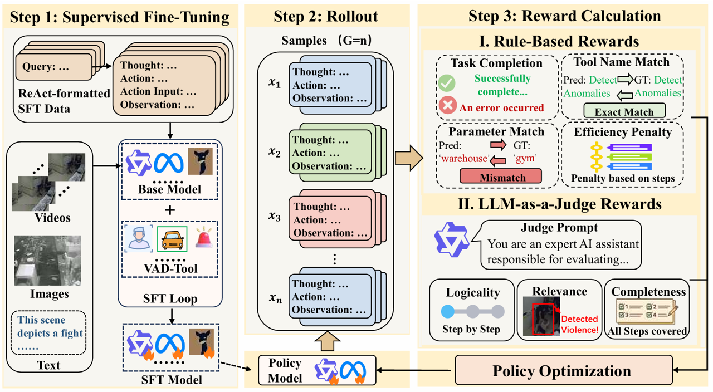

# VTO: Visual Tool Orchestration for Video Anomaly Detection

[Rui Wang](https://orcid.org/0000-0001-5919-0847)<sup>1,†</sup>, [Yeteng Wu](https://orcid.org/0009-0000-3680-6178)<sup>1,†</sup>, [Xianlin Zhang](https://orcid.org/0000-0003-3905-2062)<sup>2</sup>, [Mengshi Qi](https://orcid.org/0000-0002-6955-6635)<sup>1,*</sup>

<sup>1</sup> State Key Laboratory of Networking and Switching Technology, Beijing University of Posts and Telecommunications, China<br>
<sup>2</sup> School of Digital Media & Design Arts, Beijing University of Posts and Telecommunications, China<br>
<sup>†</sup> Rui Wang and Yeteng Wu contributed equally to this work.<br>
<sup>*</sup> Corresponding author: Mengshi Qi.

---

## News

- Our paper is accepted to ACM Multimedia 2026 (MM '26).

---

## Overview
<p align="center">
    
  </p>
VTO is a process-supervised reinforcement learning framework for dynamic visual-tool orchestration in video anomaly detection (VAD). Instead of treating visual tools as isolated modules, VTO iteratively reasons over a video, invokes specialized experts, incorporates their observations, and constructs a complete causal chain before producing an explainable anomaly report.

- **VAD-Tool benchmark.** A hierarchical tool environment with 12 visual experts covering entity tracking, behavior and scene understanding, and high-stakes hazard detection.
- **Process-Supervised Cognitive Alignment.** Fine-grained step-wise supervision combines objective tool-execution signals with foundation-model-based assessments of logicality and causal completeness.
- **Dynamic policy optimization.** GRPO improves multi-step orchestration while explicitly discouraging premature termination after detecting only a primary anomaly.

VTO improves tool-scheduling accuracy by up to **10.2 absolute percentage points** over the evaluated baselines and enables compact models to outperform substantially larger models on complex multi-step anomaly reasoning.

---

## VAD-Tool

The 12 tools are organized according to a practical security-analysis pipeline:

| Category | Visual experts | Supported inputs |
| --- | --- | --- |
| Entity Identity & Tracking | Person Re-identification, Gait Recognition, License Plate Recognition, Vehicle Re-identification | Image / Video |
| Behavior & Scene Understanding | Pose Estimation, Human Fall Detection, Crowd Counting, Scene Recognition | Image / Video |
| Security Event & Hazard Detection | Violence Detection, Weapon Detection, Fire and Smoke Detection, Anomaly Detection | Image / Video / Text |

The benchmark covers both single-step tasks and interrelated multi-step tasks. The current repository snapshot contains the orchestration code and selected tool implementations under `tools/`. Dataset annotations, training recipes, and some pretrained checkpoints are not included in this snapshot; add them separately before attempting full reproduction.

---


## Repository Structure

```text
VTO/
├── README.md
├── VIoTGPT_Vision_nodemo1.py       # tool wrappers and agent prompts
├── ww_test_VIoTGPT_test_analysis.py # batch inference/evaluation entry point
├── main_models/                     # LLM and VLM adapters
├── tools/                           # selected visual-tool implementations
└── assets/                          # README figures
```

The batch entry point reads a JSON array, lets the language model select one or more loaded visual tools, and writes the reasoning trace and final response to a JSONL file.

## Installation

> [!IMPORTANT]
> This is a research release rather than a plug-and-play application. The full pipeline requires multiple pretrained checkpoints, a CUDA-capable GPU, and dependencies from several upstream projects. This snapshot does not provide a root `requirements.txt` or a frozen Conda environment, so exact dependency versions cannot currently be reproduced with one command.

### 1. Clone the repository

```bash
git clone https://github.com/MICLAB-BUPT/VTO.git
cd VTO
```

Run all commands from the repository root. Several scripts create relative output directories and assume that the current working directory is the project root.

### 2. Create an environment

A Linux system with an NVIDIA GPU is expected. The evaluation loop calls CUDA APIs unconditionally, and the language model is loaded in 8-bit mode for the Qwen and LoRA paths.

```bash
conda create -n vto python=3.10 -y
conda activate vto
python -m pip install --upgrade pip
```

Install a PyTorch build compatible with the local CUDA driver by following the [official PyTorch installation guide](https://pytorch.org/get-started/locally/). Then install the shared Python packages:

```bash
python -m pip install \
  requests numpy scipy pandas pillow matplotlib tqdm pyyaml shortuuid \
  jsonlines opencv-python gradio langchain transformers accelerate peft \
  bitsandbytes qwen-vl-utils ultralytics
```

The Qwen wrappers currently force FlashAttention 2. Install it after PyTorch when using a Qwen model:

```bash
python -m pip install flash-attn --no-build-isolation
```

Install the requirements for every visual tool that will be imported or used. The repository currently includes requirement files for the following components:

```bash
python -m pip install -r tools/FSDetect/requirements.txt
python -m pip install -r tools/HumanFallDetection/requirements.txt
python -m pip install -r tools/HumanPoseEstimation/requirements.txt
python -m pip install -r tools/VideoAnomalyDetection/requirements.txt
python -m pip install -e tools/HumanPoseEstimation
```

Some upstream tools require mutually incompatible package versions. In that case, use isolated environments for the tool services and the orchestration model. The current Python entry point imports all tool backends eagerly, even when `--load` selects only a subset, so every top-level import must be available before the script can start.

## Configuration Checklist

Complete the following items before running inference:

1. **Fix the prompt import.** `ww_test_VIoTGPT_test_analysis.py` imports `PREFIX`, `FORMAT_INSTRUCTIONS`, and `SUFFIX` from `VIoTGPT_Vision_nodemodata`, which is not present in this snapshot. These constants are defined in `VIoTGPT_Vision_nodemo1.py`; update the import accordingly or restore the missing module.
2. **Replace machine-specific paths.** `VIoTGPT_Vision_nodemo1.py` contains paths rooted at `/home/wyt/VIoTGPT`. Replace them with the absolute path to your clone or refactor them to derive from `script_directory`.
3. **Align module directory names.** Several imports use the original experiment names, while this snapshot uses release names such as `FSDetect`, `CrowdCounting`, `SceneRecognition`, `PlateRecognition`, `GaitRecognition`, `VideoAnomalyDetection`, and `ViolenceDetection`. Update `sys.path` and imports, or restore the expected upstream directory layout.
4. **Restore external components.** The entry point references components that are not present in this snapshot, including SAM2, ChildDetection, MOTIP, DSFD face detection, and Zero-DCE. Install or copy the corresponding upstream projects if those imports remain enabled.
5. **Download model weights.** Tool wrappers expect local checkpoints for re-identification, fire/smoke detection, pose estimation, weapon detection, scene recognition, crowd counting, tracking, face detection, plate recognition, gait recognition, violence detection, and video anomaly detection. Follow the README inside each `tools/<ToolName>/` directory and update the checkpoint paths in `VIoTGPT_Vision_nodemo1.py`.
6. **Provide an orchestration model.** `--model_path` must point to a local Hugging Face-format base model. `--lora_path` is optional and should point to the trained VTO adapter when one is available.

Useful checks before a full run:

```bash
# Find paths retained from the original machine.
grep -n "/home/wyt/VIoTGPT" VIoTGPT_Vision_nodemo1.py

# Check the command-line interface without loading the models.
python ww_test_VIoTGPT_test_analysis.py --help
```

The second command will still import every backend. If it fails with `ModuleNotFoundError`, install or configure the named backend first.

## Running Batch Inference

### 1. Prepare the input file

`--query_path` must be a JSON file containing an array of objects. Every object requires:

- `query`: the natural-language question given to the orchestration agent;
- `img_full_path`: an image path, an MP4 path, or two comma-separated paths for a mixed image/video query.

Example `examples/queries.json`:

```json
[
  {
    "query": "Is there smoke or fire in this video?",
    "img_full_path": "./media/fire_test.mp4"
  },
  {
    "query": "Does the person in the image appear in the video?",
    "img_full_path": "./media/person.jpg,./media/gallery.mp4"
  }
]
```

When a media path begins with `./`, the script removes the leading dot and prepends `--query_data_path`. For the example above, set `--query_data_path` to the absolute project or dataset root containing `media/`. Absolute paths are used unchanged. The current dispatcher recognizes `.mp4` as video; other single-file suffixes are treated as images.

### 2. Select tools

`--load` is a comma-separated list in the form `ClassName_device`. For example:

```text
FSDetect_cuda:0,HumanFallDetection_cuda:0,SceneRecognition_cuda:1
```

The accepted class identifiers in the current evaluation script are:

| Identifier | Capability |
| --- | --- |
| `PersonReid` | person appearance matching |
| `VehicleReid` | vehicle appearance matching |
| `GaitRecognition` | person gait matching |
| `PlateRecognition` | license-plate matching |
| `HumanPoseEstimation` | 2D human pose estimation |
| `HumanPoseTracking` | pose and trajectory tracking |
| `HumanFallDetection` | fall detection |
| `CrowdCounting` | crowd counting |
| `SceneRecognition` | scene classification |
| `FSDetect` | fire and smoke detection |
| `GroundingDINOWeaponDetector` | knife and gun detection |
| `ViolenceDetection` | violence/anomaly category detection |
| `VideoAnomalyDetection` | open-ended video anomaly analysis |
| `FaceDetection` | face detection |

Only load tools whose dependencies, imports, and checkpoints have been configured successfully.

### 3. Run an initial smoke test

Create the output directories first, then process one sample with `--limit 1`:

```bash
mkdir -p outputs evaluation

python ww_test_VIoTGPT_test_analysis.py \
  --model_path /absolute/path/to/Qwen2.5-VL-model \
  --lora_path /absolute/path/to/VTO-LoRA-adapter \
  --load "FSDetect_cuda:0" \
  --query_path /absolute/path/to/examples/queries.json \
  --query_data_path /absolute/path/to/dataset-root \
  --output_path outputs/predictions.jsonl \
  --stats_path evaluation/tool_stats.txt \
  --limit 1
```

Remove `--lora_path` when running a supported base model without an adapter. After the smoke test succeeds, remove `--limit 1` to process the full input file.

Model selection is currently based on a case-sensitive substring in `--model_path`:

- a path containing `Qwen2` selects `Qwen25VLModel`;
- a path containing `Qwen3` selects `Qwen3VLModel`;
- a path containing `LLAMA3` selects `Llama3Model`;
- other paths select the legacy Llama wrapper, with `LoraModel` used when `--lora_path` is non-empty.

### Command-line Arguments

| Argument | Required | Description |
| --- | --- | --- |
| `--model_path` | yes in practice | local base-model directory |
| `--lora_path` | no | local VTO LoRA adapter; empty by default |
| `--load` | no | tools and CUDA devices; default is `FaceDetection_cuda:0` |
| `--query_path` | yes in practice | input JSON array |
| `--query_data_path` | recommended | prefix applied to paths beginning with `./` |
| `--output_path` | yes | destination JSONL file |
| `--stats_path` | no | tool-call statistics file; default is `./evaluation/tool_stats.txt` |
| `--limit` | no | process only the first N examples |

## Outputs

Each line in `--output_path` is a JSON object with:

| Field | Meaning |
| --- | --- |
| `image_name_GT` | resolved input media path or paths |
| `id` | the original query text |
| `chains` | raw agent action logs |
| `parsed_steps` | parsed Thought, Action, Action Input, and Observation records |
| `result` | final natural-language answer, or an error message |

`--stats_path` contains the number of calls, successful calls, and success rate for every loaded tool. Some tools also create visualized images or videos under `images/`, `image/`, `videos/`, or `output/`.

## Troubleshooting

- **`ModuleNotFoundError` during `--help`:** the entry point imports every backend before parsing arguments. Configure all imports or guard/remove backends that are not being used.
- **Checkpoint not found:** download the weight named by the exception and update the corresponding path in `VIoTGPT_Vision_nodemo1.py`.
- **Input file is reported missing:** use absolute media paths, or ensure `--query_data_path` is the correct prefix for entries beginning with `./`.
- **CUDA out of memory:** load fewer tools, distribute tools across devices in `--load`, shorten the input video, or use a smaller/quantized orchestration model.
- **Output file cannot be created:** create the parent directory before starting the command.
- **Dependency conflicts:** follow the tool-specific README and isolate incompatible tools into separate environments.

---

## Acknowledgments

This project builds upon several open-source projects and pretrained models, including:

- [verl](https://github.com/volcengine/verl) — reinforcement learning framework used for GRPO training;
- [LLaMA-Factory](https://github.com/hiyouga/LLaMA-Factory) — efficient SFT and LoRA training;
- [FastReID](https://github.com/JDAI-CV/fast-reid), [OpenGait](https://github.com/ShiqiYu/OpenGait), [RTMO/MMPose](https://github.com/open-mmlab/mmpose), [MMAction2](https://github.com/open-mmlab/mmaction2), and the other visual experts integrated into VAD-Tool.

We thank the authors and maintainers of these projects for making their work publicly available.

---

## Citation

If you find this project useful, please cite:

```bibtex
@inproceedings{wang2026vto,
  title     = {VTO: Visual Tool Orchestration for Video Anomaly Detection},
  author    = {Wang, Rui and Wu, Yeteng and Zhang, Xianlin and Qi, Mengshi},
  booktitle = {Proceedings of the 34th ACM International Conference on Multimedia},
  year      = {2026},
  doi       = {10.1145/3767308.3836202}
}
```

---

## License

The paper is distributed under the Creative Commons Attribution 4.0 International License. Licensing terms for the source code and third-party models follow their respective files and upstream projects.
